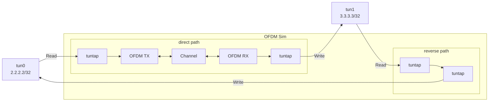

# Inject traffic in OFDM simulation via tun interafces

Simulators are great tools to get a grasp on how your flows are performing, but using them with realistic traffic patterns can be difficult. Gnuradio allow us to
hook our flows to `tuntap` interfaces. This document propose a simple local environment that alows our simulator to consume user data through `tun` interfaces.



## Create `tun` interfaces

We use `ip` tool (part of `iproute2` package) to create the 2 `tun` interfaces that we need.

```
ip tuntap add mode tun tun0
ip addr add 2.2.2.2/32 dev tun0
ip link set dev tun0 up
ip tuntap add mode tun tun1
ip addr add 3.3.3.3/32 dev tun1
ip link set dev tun1 up
```

## Remove default local routes

When an IP address is attached to an interface a corresponding route is added by default to local routing table (to route traffic betwwen
locally hosted IP addresses through `lo` interface). You can list the content of the local routing table with `ip route show table local`.
Because we don't want the traffic through our `tun` interfaces go through `lo` interface we'll delete the the 2 local routes.

```
ip route del 2.2.2.2 table local
ip route del 3.3.3.3 table local
```

## Add local routes for incoming traffic

Removing the default local routes only solve half of the problem and [Radu's post](http://rrendec.mindbit.ro/post/tun-tap-tunnels/) explains really well why. In order to make our `tun` interfaces
accept incoming local traffic we have to create new local routing entries in a custom routing table and make it visible only for input routing decision.
We can do this by setting up a rule on `iif` parameter.

```
ip route add local 2.2.2.2 dev tun0 table 19
ip rule add iif tun0 lookup 19
ip route add local 3.3.3.3 dev tun1 table 19
ip rule add iif tun1 lookup 19
```

## Add P2P routes

Now, the only thing that we have to do is to create P2P routes between the 2 interfaces.

```
ip route add 3.3.3.3/32 dev tun0
ip route add 2.2.2.2/32 dev tun1
```