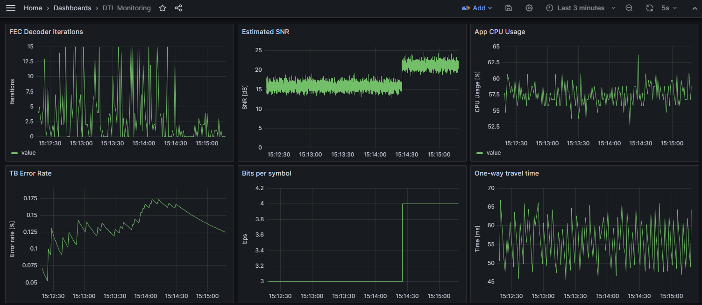

# Data Transmission Laboratory Playground

With the constant growth of Software Defined Radio (SDR) technologies in wireless related fields we proposed to build an environment where we can easily develop, test and evaluate GNU Radio applications.

## Projects

### Adaptive OFDM modem

The goal is to build a full duplex OFDM modem that adapts the transmission parameters to the channel condition to be used in lab for teaching and reasearch. Current implementation is based on ```gr-digital``` and ```gr-fec``` modules.

### Monitoring and test

The goal is to build testing infrastructure for wireless communication protocols developed with GNU Radio that is easy to use, interoperable with any traffic generator and allows collection and analysis of PHY layer monitoring data.

## Build the DTL OOT (out-of-tree) module

Clone the git repository from github

```
git clone https://github.com/mihaipstef/gr-dtl.git
```

Build and install the module

```
cd gr-dtl
mkdir build && cd build
cmake ..
make
make test
sudo make install
```

## Demo applications

```grc_run``` tool generates the Python code from the given ```*.grc``` and run it in background redirecting the standard output to files.

```
grc_run ofdm_adaptive_example <logs directory>
```
 
or
```
grc_run ofdm_adaptive_pluto <logs directory>
```


## Grafana dashboard example

Our testing ecosystem uses Grafana for data vizualization. Here is a dashboard example:
