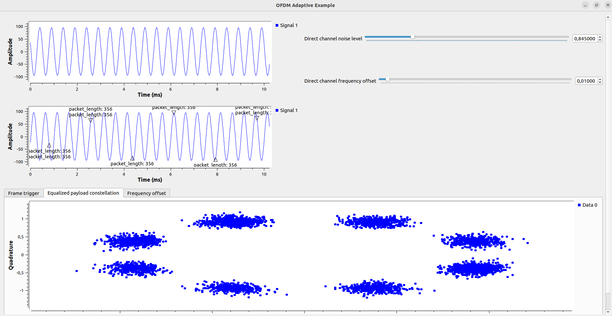
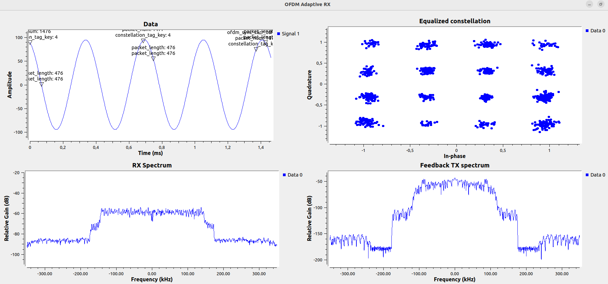

# Data Transmission Laboratory Playground

This is the DTL group OOT (out-of-tree) module to experiment with Gnuradio for teaching and research.

## Projects

### Adaptive OFDM

The goal is to build an OFDM TX/RX pair that adapts the transmission parameters to the channel condition to be used in lab for teaching and reasearch. Current implementation is heavily based on ```gr-digital``` module and only adapts the constellation it uses.

### Cloud monitoring and control

The goal is build an app that alows to monitor and control TX/RX pairs from a central point. Curently the proof of concept monitor app only collects some monitoring information.

## Build the DTL OOT

Clone the git repository from github

```
git clone https://github.com/mihaipstef/gr-dtl.git
```

Build and install the module

```
cd gr-dtl
mkdir build && cd build
cmake ..
make
make test
sudo make install
```

## Run example flows

```grc_run``` tool generates the Python code from the given ```*.grc``` and run it in background redirecting the standard output to files.

```
grc_run ofdm_adaptive_example <logs directory>
```
 
or
```
grc_run ofdm_adaptive_pluto <logs directory>
```
